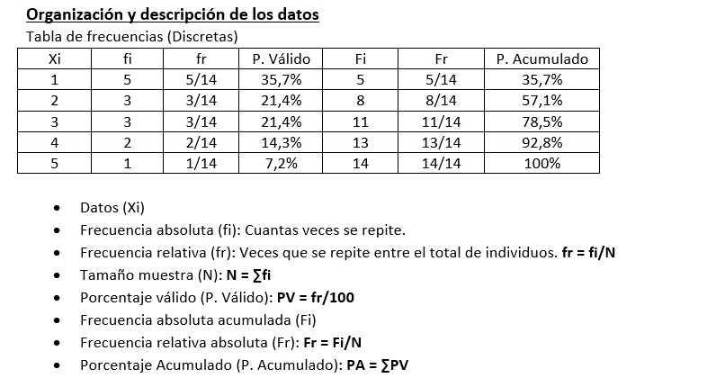

# Indice
1. [Represenacion grafica](#section-1)
    a. [Diagramas lineales (Line graphs)](#section-1-1)
    b. [Diagrama de barras (Bar chart)](#section-1-2)
    c. [Histogramas](#section-1-3)
    d. [Diagrama de sectores (Pie chart)](#section-1-4)
    e. [Diagramas de dispersion (Scatterplots)](#section-1-5)
    f. [Boxplot](#section-1-6)
2. [Estadística](#section-2)
    a. [Conceptos básicos](#section-2-1)
    b. [Tablas de frecuencia](#section-2-2)
    c. [Medidas de centralizacion](#section-2-3)
    d. [Medidas de variacion](#section-2-4)
    e. [Correlacion](#section-2-5)
    e. [Regresgion lineal](#section-2-6)


# Represenacion grafica {#section-1}
## Diagramas lineales (Line graphs) {#section-1-1}
Ejemplo
```{r}
Fibonacci <- c( 1,1,2,3,5,8,13 )
plot( Fibonacci )
```
Ejemplo más completo
```{r}
Fibonacci <- c( 1,1,2,3,5,8,13 )
plot( x = Fibonacci,                           # the data to plot
          main = "The first 7 Fibonacci numbers",  # the title
          xlab = "Position in the sequence",       # x-axis label
          ylab = "The Fibonacci number",           # y-axis 
          font.main = 1,
          cex.main = 1,
          font.axis = 2,
          col.lab = "gray50",
          type = "l" # Tipo de dibujo
)
```


## Diagrama de barras (Bar chart) {#section-1-2}
> barplot(H,xlab,ylab,main, names.arg,col)

* H: Es el vector de datos
* xlab: Etiqueta para el eje X
* ylab: Etiqueta para el eje Y
* main: Titulo del diagrama
* name.args: Vector de nombre que apareceran debajo de cada barra

Ejemplo
```{r}
H <- c(7,12,28,3,41)
M <- c("Mar","Apr","May","Jun","Jul")
barplot(H,names.arg=M,xlab="Month",ylab="Revenue",col="blue",
        main="Revenue chart",border="black")
```

## Histogramas {#section-1-3}
> hist(v,main,xlab,xlim,ylim,breaks,col,border)

* v: Es el vector de datos
* xlab: Etiqueta para el eje X
* ylab: Etiqueta para el eje Y
* main: Titulo del diagrama
* breaks: Número e barras

Para obtener ayuda sobre el comando hist:

> ?hist

Ejemplo
```{r}
# Create data for the graph.
datos <- c(9,13,21,8,36,22,12,41,31,33,19)
hist(datos)
hist(datos)$counts # Guardamos los valores de cada barra en un vector
hist(datos)$counts[2] # Para un valor concreto
```


Ejemplo
```{r}
# Indicamos el número de barras
hist(datos, breaks = 2)$breaks
```

## Diagrama de sectores (Pie chart) {#section-1-4}

> pie(x, labels, raduis, main, col, clockwise)

* X vector que contiene los datos a representar
* labels vector etiquetas
* Radio del circulo entre -1 y +1
* Main: Indica el titulo del grafico
* col: Indica la paleta de colores
* clockwise: Indica el sentido


Tenemos la posibilidad de guardar el diagrama como png
Indicamos con que nombre lo queremos guardar

> png(file = "NombreDiagrama.png")

Para guardar el diagrama
 
> dev.off()

Ejemplo
```{r}
x <- c(21, 62, 10, 53)
labels <- c("London", "New York", "Singapore", "Mumbai")
pie(x, labels, main = "Cities", col = rainbow(length(x)))
legend("topright", c("London","New York","Singapore","Mumbai"), cex = 0.8,
       fill = rainbow(length(x)))
```


## Diagramas de dispersion (Scatterplots) {#section-1-5}
Ejemplo
```{r}
input <- mtcars[,c('wt','mpg')]
plot(x = input$wt,y = input$mpg,
     xlab = "Weight",
     ylab = "Milage",
     xlim = c(2.5,5),
     ylim = c(15,30),		 
     main = "Weight vs Milage"
)
```

## Boxplot {#section-41-6}


    
# Estadistica {#section-2}
## Conceptos básicos {#section-2-1}
* Individuo: Objeto que contiene cierta información que queremos estudiar.
* Población: Conjunto de individuos que cumplen ciertas propiedades comunes.
* Caracteres/atributos (variable): Propidad, ragos o cualidades de los elementos de la población.
* Modalidades: Posibles valores que puede tomar cada variable.
* Clases: Conjunto de una o más modalidades.

### Variables y su clasificación
* Cualitativas (literales, no se pueden hacer operaciones con ellas)
  + Nomitanles: Sus valores no se pueden ordenar
  + Ordinales: Sus valores se pueden ordenar
* Cuantitativas (si sus valores son numéricos)
  + Discretas: Si toma valores enteros
  + Continuas: Si entre los valores, son posibles infinitos valores intermedios
  


## Tablas de frecuencia {#section-2-2}
### Distribución de frecuencia
La distribución de frecuencias para una variable está formada por el conjunto de 
clases y sus frecuencias correspondientes. Las representamos en tablas:



```{r}
incid <- c(12,7,3,4.2,18,2,54,-21,8,-5)
min(incid) # El minimo
max(incid) # El maximo
range(incid) # Rango: Diferencia entre observaciones extremas
sort(incid) # Ordenar los valores de un vector
cumsum(incid) # Suma acumulativa
diff(incid) # Diferencia entre los elementos consecutivos de un vector
```

### Variables cualitativas
```{r}
encuesta=c("si","no","no","si","nc","si","no","si","nc","no")
satisfaccion=c(1,3,2,1,1,2,1,2,3,3,1,1,2,3,2,1,2,3,3,2)
# Frecuencias absolutas
table(encuesta)
table(satisfaccion)
# Frecuencias relativas
table(encuesta)/length(encuesta)
table(satisfaccion)/length(satisfaccion)
# Frecuencias acumuladas
cumsum(table(encuesta))
```


### Factores nominales y ordinales
```{r}
regiones<-c("clm","and","mad","cat","mad","cat",
            "mad","clm","and","mad","cat","clm",
            "and", "mad", "cat", "mad", "cat", "mad"
            , "clm", "and")
FactorRegiones<-factor(regiones) # Factoriza todas las regiones (valor unico por region)
FactorRegiones # Comunidades que hay
levels(FactorRegiones) # Para ver los niveles del factor
ingresos<- c(800, 950, 1500, 1600, 1900, 2100, 1900, 950, 
             1000, 2100, 1950, 750, 800, 2500, 2100, 1950, 
             1900, 1800, 1100, 1400)
MediaIngresos<-tapply(ingresos,FactorRegiones,mean) # tapply nos calcula la media por region
MediaIngresos
```

### Tabla y frecuencias marginales
```{r}
encuesta=c("si","no","no","si","nc","si","no","si","nc","no")
satisfaccion=c(1,3,2,1,1,2,1,2,3,3,1,1,2,3,2,1,2,3,3,2)

# Tabla de frecuencias
table(encuesta) # Frecuencia absoluta
table(satisfaccion) 
table(encuesta)/length(encuesta) # Frecuencia relativa
table(satisfaccion)/length(satisfaccion)
cumsum(table(encuesta)) # Frecuencias acumuladas
```


## Medidas de centralización {#section-2-3}
### Media
La sintaxis básica para calcular la media es:

> mean(x, trim = 0, na.rm = FALSE, ...)

Descripción de los parámetros

* x: Es el vector de entrada
* trim: Valores que descartamos de los extremos
* na.rm: Eliminar valores nulos (NA) del vector

Ejemplo:
```{r}
x <- c(12,7,3,4.2,18,2,54,-21,8,-5)
result.mean <- mean(x)
print(result.mean)

# Otra forma de hacerlo seria usando la formula
x <- c(12,7,3,4.2,18,2,54,-21,8,-5) 
# Sumatorio del vector entre su longitud
print(sum(x)/length(x))
```

### Mediana
Es el valor o valores mas centrales de la observacion
```{r}
espera <- scan(file = "espera.txt")
sort(espera) # Se hace una operacion de ordenacion implicatamente al hacer la mediana
median(espera)
```

### Moda
Es el valor con mayor numero de ocurrencias dentro de la observacion

Esta implementacion nos sirve para valores numericos y caracteres
```{r}
v <- c(2,1,2,3,1,2,3,4,1,5,5,3,2,3)
v2 <- c('a','b','c','c','c','d','b','b','a','d','d','b','a','b')
moda <- function(x) {
  ux <- unique(x)
  ux[which.max(tabulate(match(x, ux)))]
}
moda(v)
moda(v2)
```

Podemos resumir estos datos con la funcion summary()
```{r}
summary(espera)
```

!IMPORTANTE!
La media y la modo no se ven afectadas por valores externos (no se desplzan), la media si se ve afectada.


## Medidas de variacion {#section-2-4}
### Rango
Es el valor maximo menos el valor minimo
```{r}
v <- c(2,1,2,3,1,2,3,4,1,5,5,3,2,3)
tabla <- table(v)
min(tabla) # Valor minimo
max(tabla) # Valor maximo
range(tabla) # Rango 
```

### Cuartiles y Percentiles
Un cuartil es cada uno de los tres valores que dividen los elementos de una observacion, en cuatroo partes iguales (cuartiles 25, 50 (mediana), 75)
```{r}
espera <- scan(file = "espera.txt")
quantile(espera) #Cuartiles 0, 25, 50, 75, 100
quantile(espera, 0.1) #Cuartil 10%
quantile(espera, c(.21,.15,.9)) #Cuartiles 21, 15, 90
```


### Rango intercuartilico
Diferencia entre el cuartil 25 y el cuartil 75
Nos dice donde se encuentra "la mitad superior" de los datos.
```{r}
quantile(espera, 0.75) - quantile(espera, 0.25) 
IQR(espera) 
```

### Desviacion estandar
Medida de tendencia central que representa la variabilidad de una serie de datos respecto a su media, como o donde se agrupan o de lejos estan los datos respecto a le media? (el valor absoluto de cada elemento - la media / n)
```{r}
X <- c(56, 31,56,8,32)   # datos
X.bar <- mean( X )       # media de los datos
AD <- abs( X - X.bar )   # desviacion absoluta de la media
AAD <- mean( AD )        # la desviacion media absoluta
print( AAD )             # resultado
```
### Desviacion tipica
Medida de dispersion que representa la variabilidad de una serie de datos, como o donde se agrupan los datos?
Aqui no se hace respecto si no al cuadrado, para evitar posibles compensaciones y ademas "exagera" esas diferencias
```{r}
sd(espera) # Desviacion tipica
sd(espera)/abs(mean(espera)) #Coef de variacion
```


### Varianza
Es la desviacon tipica al cuadrado, por tanto la desviacion tipica es la raiz cuadrada de la varianza.
Se puede ver muy afectada por valores atipicos o outliers.
```{r}
var(X)
```
### Simetria y curtosis
#### Simetria
Mide la mayor o menor simetria de la distribucion

* coeficiente > 0 asimetria positiva
* coeficiente = 0 simetrica
* coeficiente < 0 asimetria negativa

```{r}
# Formula
sum((espera-mean(espera))^3)/(length(espera)*sd(espera)^3)
# Libreria
fBasics::skewness(espera)
```


#### Curtosis
Mide la mayor o menor concentracion de datos alrededor de la media.

* lepticurtica > 0 menos aplanada
* mesocurtica = 0
* platicurtica < 0 mas aplanada

```{r}
# Formula
sum((espera-mean(espera))^4)/(length(espera)*sd(espera)^4)-3 
# Libreria
fBasics::kurtosis(espera)
```


## Correlacion {#section-2-5}
#### Coeficiente de correlacion o de Fisher
Miden la relacion entre multiples variables
Se representa con un scatterplot para hacernos una idea de la proximidad entre los valores de las dos variables.

La covarianza nos da solo el signo.
Para poder interpretar el resultado necesitamos un coeficiente de correlacion o de Pearson r(X, Y).

Para calcular este coeficiente usamos
```{r}
load("Variables.Rdata")
cat("Correlacion entre Var1 y Var3 =", cor(Var1,Var3, use = "pairwise.complete.obs"))
# pairwise.complete.obs para evitar posibles NA
```

Interpretacion del coeficiente de correlacion
* coeficiente > 0 relacion positiva (muy fuerte, fuerte, moderada, debil o muy debil)
* coeficiente = 0 relacion lineal
* coeficiente < 1 relacion negativa 

## Regresion lineal {#section-2-6}
Nos permite analizar la relacion entre unos valores predictores y los resultados reales
```{r}
load("emisiones.Rdata")
CO2<-emisiones$CO2;PIB<-emisiones$PIB
# Con lm creamos la regresion lineal
relation <- lm(CO2~PIB)
print(summary(relation))
```
* Estimate a b: Son los coeficientes de regresion o con p-value menor de 0.05
* Std. Error: Error estandar por cada parametro
* Multiple R-squared: Coeficiente de determinacion o Bondad de ajuste
* p-value Indica si el modelo es significativo o no


```{r}
# Prediccion
a <- data.frame(PIB<-c(2e6,4e6,6e6)) # Valores que predecimos
result <-  predict(relation,a)
print(result)

```


